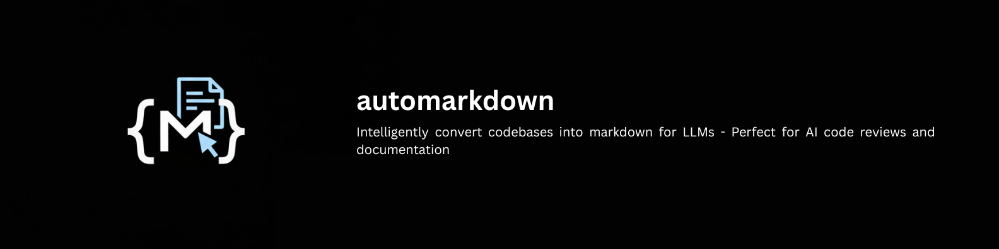

# automarkdown


Convert any codebase into LLM-ready markdown.

```bash
npx automarkdown .
```

## Why

Large language models understand markdown better than raw code directories. AutoMarkdown converts your entire codebase into a single, well structured markdown file that AI can analyze, review, and understand completely.

## What you get

- **Token analysis** for all major LLMs (GPT, Claude, Gemini)
- **Smart filtering** removes lock files, binaries, generated content
- **Zero setup** works instantly with any project
- **Auto-organization** creates clean folder structure

## Install

```bash
# No installation needed
npx automarkdown .

# Or install globally
npm install -g automarkdown
```

## Use

```bash
# Convert current directory
npx automarkdown .

# Custom output
npx automarkdown . -o docs.md

# JSON format
npx automarkdown . -f json

# Customization options
npx automarkdown . --header-level 2 --section-level 3 --file-level 4
npx automarkdown . --toc-bullet "*" --inline-code --line-numbers
npx automarkdown . --max-inline-length 100

# Create config file for persistent settings
npx automarkdown init
```

## Customization

Create `automarkdown.config.json` for persistent styling:

```json
{
  "styling": {
    "headerStyle": {
      "mainTitle": 1,    // Main title header level (1-6)
      "sectionTitle": 2, // Section header level (1-6)  
      "fileTitle": 3     // File header level (1-6)
    },
    "listStyle": {
      "tocBullet": "-",     // Table of contents bullet
      "structureBullet": "├──" // Project tree bullet
    },
    "codeStyle": {
      "useInlineCode": false,   // Use `code` for small snippets
      "maxInlineLength": 50,    // Max chars for inline code
      "showLineNumbers": false  // Add line numbers to blocks
    }
  }
}
```

## Output

```
Token Analysis:
   Estimated tokens: 11,782

Compatible LLMs (11):
   • Gemini 2.5 Pro - 1% of limit
   • GPT-5 - 3% of limit
   • Claude Opus 4.1 - 6% of limit

Recommendations:
   Good compatibility with most popular LLMs!
```

Perfect for AI code reviews, documentation, and legacy analysis.

---

[GitHub](https://github.com/harshpreet931/autoMarkdown) • [NPM](https://www.npmjs.com/package/automarkdown)

Made with 💜 by harsh