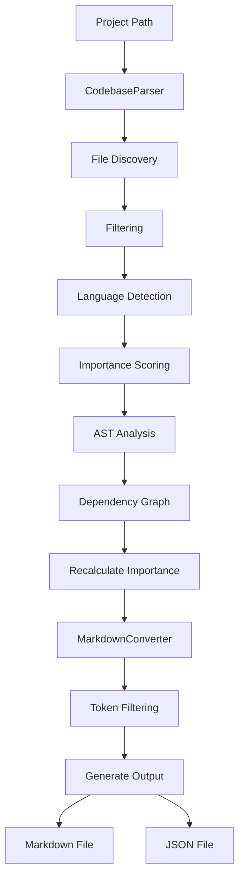

# Overview

testing\
\
AutoMarkdown is a powerful tool that converts entire codebases into LLM-ready markdown documents. It analyzes your project structure, filters out unnecessary files, and generates well-organized documentation that large language models can easily understand and process.

## Why Use AutoMarkdown?

Large language models (LLMs) understand markdown better than raw code directories. AutoMarkdown:

* **Converts codebases to markdown** - Makes codebase content AI-friendly

* **Smart filtering** - Removes lock files, binaries, and generated content

* **Token analysis** - Estimates token usage for different LLMs

* **Zero setup** - Works instantly with any project

* **Auto-organization** - Creates clean, navigable documentation

***

# Architecture

AutoMarkdown follows a modular architecture with three main components:

## 1. CodebaseParser

The parser is responsible for scanning and analyzing the project structure.

```typescript
export class CodebaseParser {
  private options: ConversionOptions;x
  private gitIgnore: ReturnType<typeof ignore> | null = null;
  private astAnalyzer: ASTAnalyzer;
}
```

//XYNE-1

### Key Responsibilities:

* **File Discovery**: Uses glob patterns to find all relevant files

* **Git Ignore Integration**: Respects `.gitignore` patterns

* **Binary Detection**: Identifies and skips binary files

* **Language Detection**: Determines programming language for each file

* **Importance Scoring**: Calculates file importance based on heuristics

### File Filtering Strategy:

The parser applies multiple layers of filtering:

1. **Extension-based filtering**: Skips common binary formats (images, videos, archives)

2. **Content analysis**: Checks for null bytes and non-printable characters

3. **Git ignore support**: Respects `.gitignore` patterns

4. **Size limits**: Ignores files larger than 1MB by default

5. **Lock file exclusion**: Removes package-lock.json, yarn.lock, etc.

### Importance Calculation:

Files are scored based on:

* **Priority files**: README.md, package.json, main.py, etc. (+10 points)

* **Configuration files**: package.json, requirements.txt, etc. (+8 points)

* **Entry points**: main.py, index.js, app.py, etc. (+7 points)

* **Documentation**: README, doc files (+6 points)

* **File size**: Smaller files get higher scores (+2 points)

* **Code complexity**: More keywords = higher score (+up to 3 points)

* **Test files**: Lower priority (-2 points)

## 2. ASTAnalyzer

The Abstract Syntax Tree (AST) analyzer provides deep code understanding.

```typescript
export class ASTAnalyzer {
  async analyzeFile(path: string, content: string, language: string): Promise<ASTMetrics>
  buildDependencyGraph(files: FileWithMetrics[]): DependencyGraph
  calculateASTImportance(metrics: ASTMetrics, centrality: number): number
}
```

### AST Analysis Features:

* **Export/Import Count**: Tracks module boundaries

* **Function Count**: Identifies code organization

* **Class Count**: Detects object-oriented structures

* **Complexity Metrics**: Analyzes code complexity

* **Dependency Graph**: Maps file relationships

* **Centrality Scoring**: Identifies critical files

### Dependency Graph:

The analyzer builds a dependency graph to understand:

* Which files import from which

* Circular dependencies

* Module coupling

* Critical paths in the codebase

## 3. MarkdownConverter

The converter transforms parsed data into markdown format.

```typescript
export class MarkdownConverter {
  convertToMarkdown(project: ParsedProject): string
  convertToJson(project: ParsedProject): string
}
```

### Output Structure:

The generated markdown includes:

1. **Header**: Project name and generation info

2. **Table of Contents**: Navigation links to all files

3. **Project Summary**: Statistics and key information

4. **Project Structure**: Tree view of directory layout

5. **File Contents**: Complete code with syntax highlighting

6. **Footer**: Generation timestamp and tips

### Token-Aware Filtering:

The converter applies intelligent token filtering:

* **Token estimation**: Estimates tokens for each file

* **Importance-based ordering**: Most important files first

* **Token limits**: Configurable limits for different LLMs

* **Dynamic filtering**: Stops including files when limit is reached

***

# Workflow

## Step-by-Step Process

```text
1. Initialize AutoMarkdown
   ↓
2. Parse Project
   ├─ Load .gitignore patterns
   ├─ Discover files using glob
   ├─ Filter out binaries and lock files
   ├─ Detect file languages
   └─ Calculate initial importance scores
   ↓
3. AST Analysis (Optional)
   ├─ Parse each file's AST
   ├─ Extract metrics (exports, functions, classes)
   ├─ Build dependency graph
   └─ Calculate centrality scores
   ↓
4. Recalculate Importance
   ├─ Combine heuristic scores with AST metrics
   └─ Weighted average (70% AST, 30% heuristics)
   ↓
5. Generate Output
   ├─ Apply token-aware filtering
   ├─ Create markdown structure
   ├─ Add table of contents
   ├─ Include file contents
   └─ Add metadata and footer
   ↓
6. Output Result
   ├─ Markdown file (default)
   └─ JSON format (optional)
```

## Data Flow



***

# Features

## Smart Filtering

AutoMarkdown intelligently filters out files that aren't useful for LLM analysis:

### Excluded by Default:

* **Lock files**: package-lock.json, yarn.lock, pnpm-lock.yaml, etc.

* **Binary files**: Images, videos, audio, executables

* **Build artifacts**: dist/, build/, node_modules/

* **Generated content**: Compiled files, minified code

* **Documentation**: PDFs, Word docs, archives

* **Config files**: .gitignore, .env, etc.

### Inclusion Patterns:

* Source code files (.js, .ts, .py, .java, etc.)

* Configuration files (package.json, requirements.txt)

* Documentation (README.md, .md files)

* Build files (Dockerfile, Makefile)

## Token Analysis

AutoMarkdown provides token estimates for different LLMs:

```typescript
// Example output
Token Analysis:
   Estimated tokens: 11,782

Compatible LLMs (11):
   • Gemini 2.5 Pro - 1% of limit
   • GPT-5 - 3% of limit
   • Claude Opus 4.1 - 6% of limit
```

## Language Support

AutoMarkdown supports 40+ programming languages:

* **JavaScript/TypeScript**: .js, .jsx, .ts, .tsx

* **Python**: .py

* **Java**: .java

* **C/C++**: .c, .cpp, .h, .hpp

* **Go**: .go

* **Rust**: .rs

* **Ruby**: .rb

* **PHP**: .php

* **And 30+ more...**f

## Output Formats

### Markdown Format (Default)

```bash
npx automarkdown .
```

Generates a comprehensive markdown document with:

* Table of contents

* Project structure tree

* File contents with syntax highlighting

* Metadata for each file

* Token estimates

### JSON Format

```bash
npx automarkdown . -f json
```

Generates structured JSON with:

* Complete file information

* AST metrics

* Dependency graph

* Project structure

* Token analysis

***

# Usage

## Basic Usage

```bash
# Convert current directory
npx automarkdown .

# Custom output file
npx automarkdown . -o docs.md

# JSON format
npx automarkdown . -f json
```

## Advanced Options

```bash
# Include hidden files
npx automarkdown . --include-hidden

# Custom output format
npx automarkdown . --format markdown

# Set token limit
npx automarkdown . --max-tokens 50000

# Exclude specific patterns
npx automarkdown . --exclude "test/**,dist/**"
```

## Programmatic Usage

```typescript
import { AutoMarkdown } from 'automarkdown';

const converter = new AutoMarkdown({
  includeHidden: false,
  maxFileSize: 1024 * 1024, // 1MB
  useASTAnalysis: true,
  maxTokens: 100000
});

// Convert to markdown
const markdown = await converter.convertProject('./my-project');

// Convert to JSON
const json = await converter.convertToJson('./my-project');
```

***

# Benefits for LLMs

## Why LLMs Love AutoMarkdown

1. **Structured Format**: Markdown provides clear structure and hierarchy

2. **Syntax Highlighting**: Code is easy to read and understand

3. **Metadata**: File information helps LLMs understand context

4. **Navigation**: Table of contents enables easy navigation

5. **Token Efficiency**: Smart filtering maximizes information density

6. **Importance Ranking**: Critical files are prioritized

## Use Cases

* **AI Code Reviews**: LLMs can review entire codebases

* **Documentation Generation**: Create comprehensive docs from code

* **Legacy Analysis**: Understand old codebases quickly

* **Code Migration**: Plan refactoring with full context

* **Learning**: Study code patterns and architecture

* **Debugging**: Get complete context for issues

***

# Technical Details

## Token Estimation

AutoMarkdown uses a simple but effective token estimation:

```typescript
// ~4 characters per token for English text
const tokens = Math.ceil(content.length / 4);
```

This provides a reasonable estimate for most LLMs.

## AST Analysis

The AST analyzer uses language-specific parsers:

* **JavaScript/TypeScript**: Babel parser

* **Python**: Tree-sitter

* **Java**: Java parser

* **C/C++**: Clang parser

For languages without built-in parsers, the analyzer falls back to heuristic-based analysis.

## Performance

* **Parallel processing**: AST analysis runs in parallel

* **Caching**: Results are cached for faster re-runs

* **Incremental updates**: Only changed files are re-analyzed

***

# Conclusion

AutoMarkdown bridges the gap between codebases and LLMs by providing:

* **Intelligent parsing** of complex projects

* **Smart filtering** to focus on relevant content

* **AST analysis** for deep code understanding

* **Token-aware generation** for optimal LLM compatibility

* **Multiple output formats** for different use cases

Whether you're doing AI code reviews, documentation, or legacy analysis, AutoMarkdown gives you the complete context you need in a format LLMs can easily process.

***

## *Documentation generated by autoMarkdown*

title: "AutoMarkdown: Intelligent Codebase to Markdown Converter"\
\
format: html
------------

# Overview

AutoMarkdown is a powerful tool that converts entire codebases into LLM-ready markdown documents. It analyzes your project structure, filters out unnecessary files, and generates well-organized documentation that large language models can easily understand and process.

## Why Use AutoMarkdown?

Large language models (LLMs) understand markdown better than raw code directories. AutoMarkdown:

* **Converts codebases to markdown** - Makes codebase content AI-friendly

* **Smart filtering** - Removes lock files, binaries, and generated content

* **Token analysis** - Estimates token usage for different LLMs

* **Zero setup** - Works instantly with any project

* **Auto-organization** - Creates clean, navigable documentation

***

# Architecture

AutoMarkdown follows a modular architecture with three main components:

## 1. CodebaseParser

The parser is responsible for scanning and analyzing the project structure.

```typescript
export class CodebaseParser {
  private options: ConversionOptions;
  private gitIgnore: ReturnType<typeof ignore> | null = null;
  private astAnalyzer: ASTAnalyzer;
}
```

### Key Responsibilities:

* **File Discovery**: Uses glob patterns to find all relevant files

* **Git Ignore Integration**: Respects `.gitignore` patterns

* **Binary Detection**: Identifies and skips binary files

* **Language Detection**: Determines programming language for each file

* **Importance Scoring**: Calculates file importance based on heuristics

### File Filtering Strategy:

The parser applies multiple layers of filtering:

1. **Extension-based filtering**: Skips common binary formats (images, videos, archives)

2. **Content analysis**: Checks for null bytes and non-printable characters

3. **Git ignore support**: Respects `.gitignore` patterns

4. **Size limits**: Ignores files larger than 1MB by default

5. **Lock file exclusion**: Removes package-lock.json, yarn.lock, etc.

### Importance Calculation:

Files are scored based on:

* **Priority files**: README.md, package.json, main.py, etc. (+10 points)

* **Configuration files**: package.json, requirements.txt, etc. (+8 points)

* **Entry points**: main.py, index.js, app.py, etc. (+7 points)

* **Documentation**: README, doc files (+6 points)

* **File size**: Smaller files get higher scores (+2 points)

* **Code complexity**: More keywords = higher score (+up to 3 points)

* **Test files**: Lower priority (-2 points)

## 2. ASTAnalyzer

The Abstract Syntax Tree (AST) analyzer provides deep code understanding.

```typescript
export class ASTAnalyzer {
  async analyzeFile(path: string, content: string, language: string): Promise<ASTMetrics>
  buildDependencyGraph(files: FileWithMetrics[]): DependencyGraph
  calculateASTImportance(metrics: ASTMetrics, centrality: number): number
}
```

### AST Analysis Features:

* **Export/Import Count**: Tracks module boundaries

* **Function Count**: Identifies code organization

* **Class Count**: Detects object-oriented structures

* **Complexity Metrics**: Analyzes code complexity

* **Dependency Graph**: Maps file relationships

* **Centrality Scoring**: Identifies critical files

### Dependency Graph:

The analyzer builds a dependency graph to understand:

* Which files import from which

* Circular dependencies

* Module coupling

* Critical paths in the codebase

## 3. MarkdownConverter

The converter transforms parsed data into markdown format.

```typescript
export class MarkdownConverter {
  convertToMarkdown(project: ParsedProject): string
  convertToJson(project: ParsedProject): string
}
```

### Output Structure:

The generated markdown includes:

1. **Header**: Project name and generation info

2. **Table of Contents**: Navigation links to all files

3. **Project Summary**: Statistics and key information

4. **Project Structure**: Tree view of directory layout

5. **File Contents**: Complete code with syntax highlighting

6. **Footer**: Generation timestamp and tips

### Token-Aware Filtering:

The converter applies intelligent token filtering:

* **Token estimation**: Estimates tokens for each file

* **Importance-based ordering**: Most important files first

* **Token limits**: Configurable limits for different LLMs

* **Dynamic filtering**: Stops including files when limit is reached

***

# Workflow

## Step-by-Step Process

```text
1. Initialize AutoMarkdown
   ↓
2. Parse Project
   ├─ Load .gitignore patterns
   ├─ Discover files using glob
   ├─ Filter out binaries and lock files
   ├─ Detect file languages
   └─ Calculate initial importance scores
   ↓
3. AST Analysis (Optional)
   ├─ Parse each file's AST
   ├─ Extract metrics (exports, functions, classes)
   ├─ Build dependency graph
   └─ Calculate centrality scores
   ↓
4. Recalculate Importance
   ├─ Combine heuristic scores with AST metrics
   └─ Weighted average (70% AST, 30% heuristics)
   ↓
5. Generate Output
   ├─ Apply token-aware filtering
   ├─ Create markdown structure
   ├─ Add table of contents
   ├─ Include file contents
   └─ Add metadata and footer
   ↓
6. Output Result
   ├─ Markdown file (default)
   └─ JSON format (optional)
```

## Data Flow


***

# Features

## Smart Filtering

AutoMarkdown intelligently filters out files that aren't useful for LLM analysis:

### Excluded by Default:

* **Lock files**: package-lock.json, yarn.lock, pnpm-lock.yaml, etc.

* **Binary files**: Images, videos, audio, executables

* **Build artifacts**: dist/, build/, node_modules/

* **Generated content**: Compiled files, minified code

* **Documentation**: PDFs, Word docs, archives

* **Config files**: .gitignore, .env, etc.

### Inclusion Patterns:

* Source code files (.js, .ts, .py, .java, etc.)

* Configuration files (package.json, requirements.txt)

* Documentation (README.md, .md files)

* Build files (Dockerfile, Makefile)

## Token Analysis

AutoMarkdown provides token estimates for different LLMs:

```typescript
// Example output
Token Analysis:
   Estimated tokens: 11,782

Compatible LLMs (11):
   • Gemini 2.5 Pro - 1% of limit
   • GPT-5 - 3% of limit
   • Claude Opus 4.1 - 6% of limit
```

## Language Support

AutoMarkdown supports 40+ programming languages:

* **JavaScript/TypeScript**: .js, .jsx, .ts, .tsx

* **Python**: .py

* **Java**: .java

* **C/C++**: .c, .cpp, .h, .hpp

* **Go**: .go

* **Rust**: .rs

* **Ruby**: .rb

* **PHP**: .php

* **And 30+ more...**

## Output Formats

### Markdown Format (Default)

```bash
npx automarkdown .
```

Generates a comprehensive markdown document with:

* Table of contents

* Project structure tree

* File contents with syntax highlighting

* Metadata for each file

* Token estimates

### JSON Format

```bash
npx automarkdown . -f json
```

Generates structured JSON with:

* Complete file information

* AST metrics

* Dependency graph

* Project structure

* Token analysis

***

# Usage

## Basic Usage

```bash
# Convert current directory
npx automarkdown .

# Custom output file
npx automarkdown . -o docs.md

# JSON format
npx automarkdown . -f json
```

## Advanced Options

```bash
# Include hidden files
npx automarkdown . --include-hidden

# Custom output format
npx automarkdown . --format markdown

# Set token limit
npx automarkdown . --max-tokens 50000

# Exclude specific patterns
npx automarkdown . --exclude "test/**,dist/**"
```

## Programmatic Usage

```typescript
import { AutoMarkdown } from 'automarkdown';

const converter = new AutoMarkdown({
  includeHidden: false,
  maxFileSize: 1024 * 1024, // 1MB
  useASTAnalysis: true,
  maxTokens: 100000
});

// Convert to markdown
const markdown = await converter.convertProject('./my-project');

// Convert to JSON
const json = await converter.convertToJson('./my-project');
```

***

# Benefits for LLMs

## Why LLMs Love AutoMarkdown

1. **Structured Format**: Markdown provides clear structure and hierarchy

2. **Syntax Highlighting**: Code is easy to read and understand

3. **Metadata**: File information helps LLMs understand context

4. **Navigation**: Table of contents enables easy navigation

5. **Token Efficiency**: Smart filtering maximizes information density

6. **Importance Ranking**: Critical files are prioritized

## Use Cases

* **AI Code Reviews**: LLMs can review entire codebases

* **Documentation Generation**: Create comprehensive docs from code

* **Legacy Analysis**: Understand old codebases quickly

* **Code Migration**: Plan refactoring with full context

* **Learning**: Study code patterns and architecture

* **Debugging**: Get complete context for issues

***

# Technical Details

## Token Estimation

AutoMarkdown uses a simple but effective token estimation:

```typescript
// ~4 characters per token for English text
const tokens = Math.ceil(content.length / 4);
```

This provides a reasonable estimate for most LLMs.

## AST Analysis

The AST analyzer uses language-specific parsers:

* **JavaScript/TypeScript**: Babel parser

* **Python**: Tree-sitter

* **Java**: Java parser

* **C/C++**: Clang parser

For languages without built-in parsers, the analyzer falls back to heuristic-based analysis.

## Performance

* **Parallel processing**: AST analysis runs in parallel

* **Caching**: Results are cached for faster re-runs

* **Incremental updates**: Only changed files are re-analyzed

***

# Conclusion

AutoMarkdown bridges the gap between codebases and LLMs by providing:

* **Intelligent parsing** of complex projects

* **Smart filtering** to focus on relevant content

* **AST analysis** for deep code understanding

* **Token-aware generation** for optimal LLM compatibility

* **Multiple output formats** for different use cases

Whether you're doing AI code reviews, documentation, or legacy analysis, AutoMarkdown gives you the complete context you need in a format LLMs can easily process.

***
